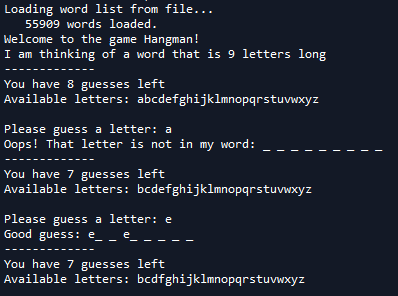
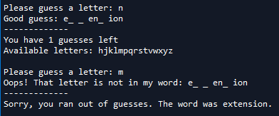
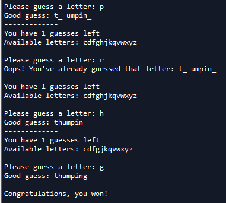

# Hangman
A Python based implementation of the popular paper and pencil guessing game!

For game rules, checkout the Hangman WikiHow: https://www.wikihow.com/Play-Hangman

Should be easy to follow the code/comments- Simply run the hangman.py file and the program will prompt you for guesses.

Some functionalities:
  - The program keeps track of letters you have already guessed and does not count repeat guesses of the same letter against you.
  - After each guess, the program provides you a list of available letters (ie those you have not yet guessed)
  - By default, you get 8 guesses but this can be changed by altering the variable "NUM_GUESSES" near the top of the program.
  - By default, the program randomly selects a word from those provided in words.txt. However, if 2 individuals are playing the game, one of the individuals can use their own word by changing the secretWord value in the 2nd last line.
  

